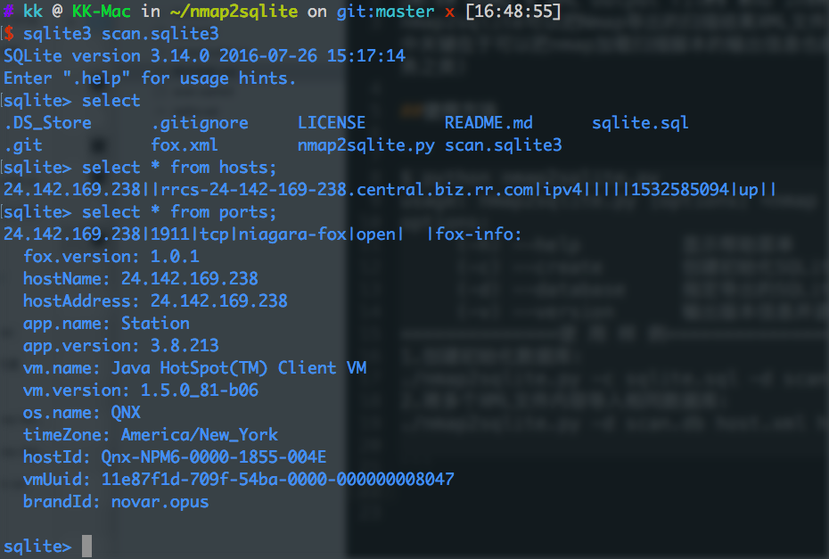

# nmap2sqlite
parse Nmap's XML output files and insert them into an SQLite database
nmap2sqlite可以把Nmap导出的扫描结果XML文件进行解析，提取出关键信息保存到SQLite数据库中(其中关键在于可以把nmap加载扫描脚本的输出信息也提取到数据库中，而不是简单的保存主机IP、端口、服务之类)

##使用方法

```
$ python nmap2sqlite.py 
usage: nmap2sqlite.py [options] <nmap output XML file(s)>
options:
     (-h) --help         显示帮助菜单
     (-c) --create       创建初始化SQLite数据库
     (-d) --database     指定导出的SQLite数据库
     (-v) --version      输出版本信息并退出
==============使 用 样 例=====================
1.创建初始化数据库: 
./nmap2sqlite.py -c sqlite.sql -d scan.db
2.将多个XML文件内容导入相同数据库: 
./nmap2sqlite.py -d scan.db host.xml host2.xml host3.xml ...

```

